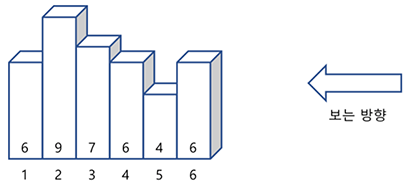

# algorithm

생각 날때마다 틈틈히 풀어보는 알고리즘 문제

- 조건에 따른 숫자 변경( password.js )
- for, if,else를 이용한 배열정렬 후 최소, 최대, 중간값 찾기( minmaxcenter.js )
- 배열정렬하기( numberberSort.js)
- 랜덤한 숫자 맞추기( up&down게임 ) - up&down.html
- 베스킨라빈스31 게임( 무조건 지는 게임 ) - baskinrabbins.html
- 보이는 막대기 개수 구하기( stick.js )

  - 높이만 다르고( 같은 높이의 막대기가 있을 수 있음)모양이 같은 막대기를 일렬로 세운 후, 왼쪽부터 차례로 번호를 붙인다.

  - 각 막대기의 높이는 그림에서 보인 것처럼 순서대로 <code>6,9,7,6,4,6</code>이다.
    
  - N개의 막대기에 대한 높이 정보가 주어질 때, 오른쪽에서 보아서 몇 개가 보이는지를 알아내는 프로그램을 작성.

- n을 m 이하의 자연수로만 나타내는 방법(분할수 - naturalnumdiv.js )
