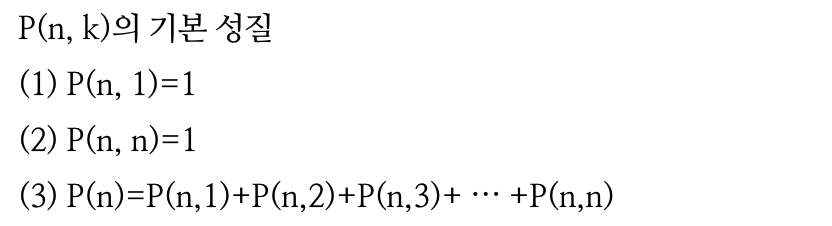
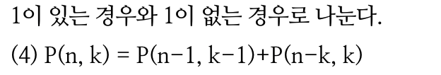
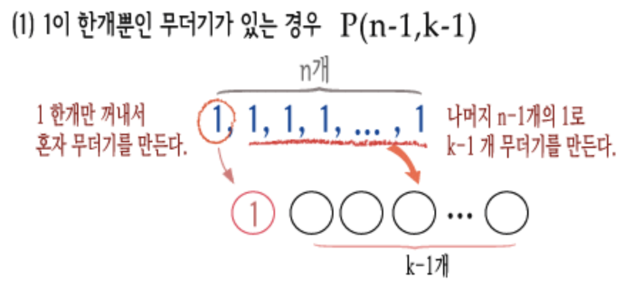
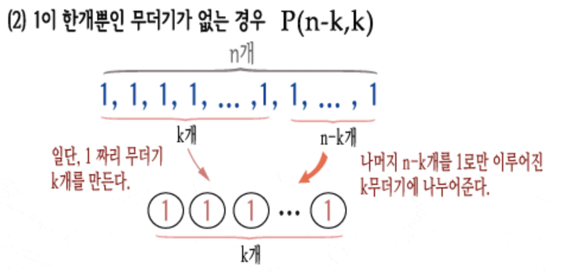
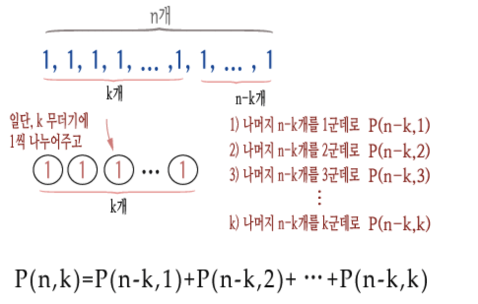
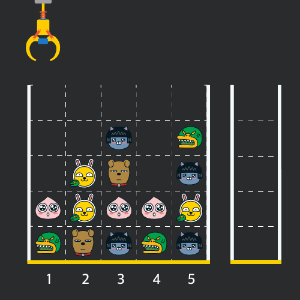

# algorithm

생각 날때마다 틈틈히 풀어보는 알고리즘 문제

- 조건에 따른 숫자 변경( password.js )
- for, if,else를 이용한 배열정렬 후 최소, 최대, 중간값 찾기( minmaxcenter.js )
- 배열정렬하기( numberberSort.js)
- 랜덤한 숫자 맞추기( up&down게임 ) - up&down.html
- 베스킨라빈스31 게임( 무조건 지는 게임 ) - baskinrabbins.html
- 보이는 막대기 개수 구하기( stick.js )

  - 높이만 다르고( 같은 높이의 막대기가 있을 수 있음)모양이 같은 막대기를 일렬로 세운 후, 왼쪽부터 차례로 번호를 붙인다.

  - 각 막대기의 높이는 그림에서 보인 것처럼 순서대로 <code>6,9,7,6,4,6</code>이다.
    
  - N개의 막대기에 대한 높이 정보가 주어질 때, 오른쪽에서 보아서 몇 개가 보이는지를 알아내는 프로그램을 작성.

- n을 m 이하의 자연수로만 나타내는 방법(분할수 - partionNumber.js )

  <details>

    <summary>상세보기</summary>

  
  

  - (1)의 자연수 n을 한 덩어리로 만드는 방법은 당연히 1개,
  - (2)의 자연수 n을 n개의 무더기로 만드는 방법 역시 1개
    - ex) 5 = [1, 1, 1, 1, 1]
  - (3)의 P(n)은 n의 분할 수라고 하며, n을 분할하는 모든 경우의 수를 나타냄.
  - (4)의식은 P(n, k)를 두 가지 경우로 나눈 것.
    
    

    > 즉 P(n, k)를
    > ⓵ 1로 이루어진 무더기가 존재하는 경우 P( n-1, k-1 )
    > ⓶ 1로 이루어진 무더기가 없는 경우 P( n-k, k )
    > 이렇게 두 가지 경우로 나누어서 구한다는 의미

  

  </details>

* 셀프넘버찾기 ( selfNumber.js )

  - 1 ~ 5000 사이에 존재하는 셀프넘버의 합 구하기

  <details>
      <summary>상세보기</summary>

      어떤 자연수 n이 있을 때, d(n)을 n의 각 자릿수 숫자들과 n 자신을 더한 숫자라고 정의

      > d(91) = 9 + 1 + 91 = 101

      이 때, n을 d(n)의 제네레이터(generator)라고 한다. 위의 예에서 91은 101의 제네레이터이다.
      어떤 숫자들은 하나 이상의 제네레이터를 가지고 있는데, 101의 제네레이터는 91 뿐 아니라 100도 있다.
      그런데 반대로, 제네레이터가 없는 숫자들도 있으며, 이런 숫자를 인도의 수학자 Kaprekar가 셀프 넘버(self-number)라 이름 붙였다.
      예를 들어 1,3,5,7,9,20,31 은 셀프 넘버 들이다.

  </details>

## 프로그래머스

- 인형뽑기 ( clawmachine.js )
  <details>
      <summary>상세보기</summary>

  - "N x N" 크기의 맵 정보에 모든 인형은 "1 x 1" 크기의 격자 한 칸을
    차지하며 격자의 가장 아래 칸부터 차곡차곡 쌓여 있습니다

    

  - 크레인을 좌우로 움직여 멈춘 위치에서 가장 위에 있는 인형을 집어 올릴 수 있습니다.
    집어 올린 인형은 바구니에 쌓이게 되는 데, 이때 바구니의 가장 아래 칸부터 인형이 순서대로 쌓이게 됩니다.
    다음 그림은 [1번, 5번, 3번] 위치에서 순서대로 인형을 집어 올려 바구니에 담은 모습입니다

    

  - 같은 모양의 인형 두 개가 바구니에 연속해서 쌓이게 되면 두 인형은 터뜨려지면서 바구니에서 사라지게 됩니다.
    위 상태에서 이어서 [5번] 위치에서 인형을 집어 바구니에 쌓으면 같은 모양 인형 두 개가 없어집니다  
    

  - 크레인 작동 시 인형이 집어지지 않는 경우는 없으나 만약 인형이 없는 곳에서 크레인을 작동시키는 경우에는
    아무런 일도 일어나지 않습니다

  - 바구니는 모든 인형을 담을 만큼 충분히 크다고 가정
    </detail>

* 숫자 문자열과 영단어 ( replaceString.js )
  - 주어진 문자열에서 문자를 숫자로 변환해서 리턴
  ```text
    "one4seveneight" => 1478
    "23four5six7" => 234567
    "1zerotwozero3" => 10203
  ```
* 추천아이디 ( recomandID.js )
    <details>
    <summary>상세설명</summary>

  - 아이디는 3자이상 15자 이하
  - 아이디는 알파벳 소문자, 숫자, 빼기(-), 밑줄(\_), 마침표(.) 만 사용가능
  - 마침표는 시작과 끝에 사용할 수 없음

    new_id = '...!@BaT#\*..y.abcdefghijklm'

    - 1단계 new_id의 모든 문자를 소문자 치환
    - 2단계 new_id에 알파벳 소문자, 숫자, 빼기, 마침표를 제외한 모든 문자 제거
    - 3단계 new_id에 마침표가 2번 연속되면 하나로 치환
    - 4단계 new_id에 마침표가 처음과 끝에 나오면 제거
    - 5단계 new_id가 빈 문자열이라면 'a'를 대입
    - 6단계 new_id의 길이가 16자 이상이면 15개를 제외한 모든 문자를 제거
      15자의 마지막이 마침표일 경우도 제거
    - 7단계 new_id의 길이가 2자 이하라면 new_id의 마지막 문자를 new_id의 길이가 3이상이 될 때까지 추가

  **제한사항**

  - new_id의 길이는 1이상 1000이하
  - new_id는 알파벳 대소문자, 숫자, 특수 문자로 구성
  - new*id에 나타낼 수 있는 특수문자는 -*.~!@#$%^&\*()=+[{]}:?,<>/ 로 한정

</details>

- 신고결과받기
     <details>
     <summary>상세보기</summary>

  게시판 불량 이용자 신고처리 결과 메일 발송 시스템  
   **요구사항**

  - 유저는 한 번에 한 명의 유저를 신고할 수 있다.

    - 신고 횟수는 제한이 없음. 서로 다른 유저를 계속해서 신고가능.
    - 한 유저를 여러 번 신고할 수도 있지만, 동일한 유저에 대한 신고 횟수는 1회로 처리.

  - k번(k=2)신고된 유저는 게시판 이용이 정지되며, 해당 유저를 신고한 모든 유저에게 정지 사실을 메일로 발송 - 유저가 신고한 모든 내용을 취합해 마지막에 한번에 게시판 이용 정지 메일을 발송.

  #

  - _이용자 ID가 담긴 문자열 id_list,  
    각 이용자가 신고한 유저 ID정보가 담긴 report,  
    정지 기준이 되는 신고횟수 k가 매개변수로 주어질 때,  
    유저별 처리 결과 메일을 받은 횟수를 배열에 담아  
    return 하도록 solution함수를 완성_

  **예시**

  유저목록 : ["muzi", "frodo", "apeach", "neo"]  
  k = 2

  | 유저ID | 유저가 신고한 ID | 설명                      |
  | ------ | ---------------- | ------------------------- |
  | muzi   | frodo            | "muzi"가 "frodo"를 신고   |
  | apeach | frodo            | "apeach"가 "frodo"를 신고 |
  | frodo  | neo              | "frodo"가 "neo"를 신고    |
  | muzi   | neo              | "muzi"가 "neo"를 신고     |
  | apeach | muzi             | "apeach"가 "muzi"를 신고  |

  유저별 신고횟수

  | 유저ID | 신고당한 횟수 |
  | ------ | ------------- |
  | muzi   | 1             |
  | frodo  | 2             |
  | apeach | 0             |
  | neo    | 2             |

  결과  
  |유저ID|유저가 신고한 ID|정지된 ID|
  |---|---|---|
  |muzi|["frodo","neo"]|["frodo","neo"]
  |frodo|["neo"]|["neo"]|
  |apeach|["muzi","frodo"]|["frodo"]|
  |neo|없음|없음|

</details>
