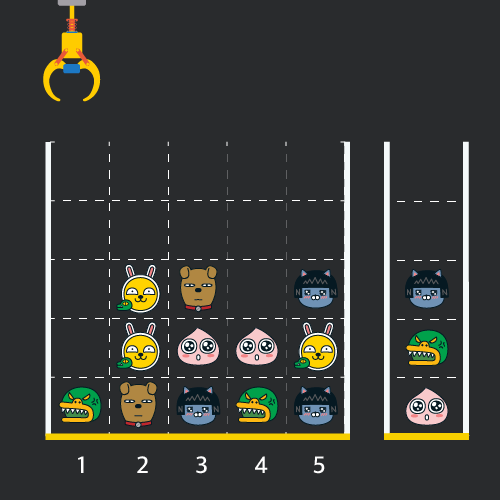

# algorithm

생각 날때마다 틈틈히 풀어보는 알고리즘 문제

- 조건에 따른 숫자 변경( password.js )
- for, if,else를 이용한 배열정렬 후 최소, 최대, 중간값 찾기( minmaxcenter.js )
- 배열정렬하기( numberberSort.js)
- 랜덤한 숫자 맞추기( up&down게임 ) - up&down.html
- 베스킨라빈스31 게임( 무조건 지는 게임 ) - baskinrabbins.html
- 보이는 막대기 개수 구하기( stick.js )

  - 높이만 다르고( 같은 높이의 막대기가 있을 수 있음)모양이 같은 막대기를 일렬로 세운 후, 왼쪽부터 차례로 번호를 붙인다.

  - 각 막대기의 높이는 그림에서 보인 것처럼 순서대로 <code>6,9,7,6,4,6</code>이다.
    
  - N개의 막대기에 대한 높이 정보가 주어질 때, 오른쪽에서 보아서 몇 개가 보이는지를 알아내는 프로그램을 작성.

- n을 m 이하의 자연수로만 나타내는 방법(분할수 - partionNumber.js )
  
  

  - (1)의 자연수 n을 한 덩어리로 만드는 방법은 당연히 1개,
  - (2)의 자연수 n을 n개의 무더기로 만드는 방법 역시 1개
    - ex) 5 = [1, 1, 1, 1, 1]
  - (3)의 P(n)은 n의 분할 수라고 하며, n을 분할하는 모든 경우의 수를 나타냄.
  - (4)의식은 P(n, k)를 두 가지 경우로 나눈 것.
    
    

        > 즉 P(n, k)를
        > ⓵ 1로 이루어진 무더기가 존재하는 경우 P( n-1, k-1 )
        > ⓶ 1로 이루어진 무더기가 없는 경우 P( n-k, k )
        > 이렇게 두 가지 경우로 나누어서 구한다는 의미

  

프로그래머스 문제

- 인형뽑기 ( clawmachine.js )

  - "N x N" 크기의 맵 정보에 모든 인형은 "1 x 1" 크기의 격자 한 칸을
    차지하며 격자의 가장 아래 칸부터 차곡차곡 쌓여 있습니다

    

  - 크레인을 좌우로 움직여 멈춘 위치에서 가장 위에 있는 인형을 집어 올릴 수 있습니다.
    집어 올린 인형은 바구니에 쌓이게 되는 데, 이때 바구니의 가장 아래 칸부터 인형이 순서대로 쌓이게 됩니다.
    다음 그림은 [1번, 5번, 3번] 위치에서 순서대로 인형을 집어 올려 바구니에 담은 모습입니다

    

  - 같은 모양의 인형 두 개가 바구니에 연속해서 쌓이게 되면 두 인형은 터뜨려지면서 바구니에서 사라지게 됩니다.
    위 상태에서 이어서 [5번] 위치에서 인형을 집어 바구니에 쌓으면 같은 모양 인형 두 개가 없어집니다
    

  - 크레인 작동 시 인형이 집어지지 않는 경우는 없으나 만약 인형이 없는 곳에서 크레인을 작동시키는 경우에는
    아무런 일도 일어나지 않습니다

  - 바구니는 모든 인형을 담을 만큼 충분히 크다고 가정

- 숫자 문자열과 영단어 ( replaceString.js )
  - 주어진 문자열에서 문자를 숫자로 변환해서 리턴
  ```text
    "one4seveneight" => 1478
    "23four5six7" => 234567
    "1zerotwozero3" => 10203
  ```
